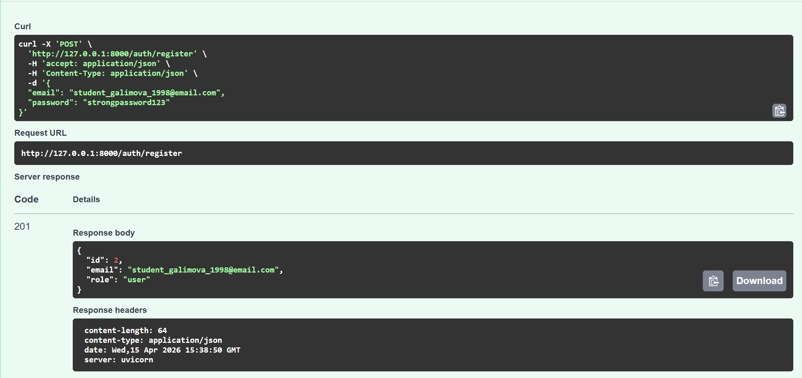
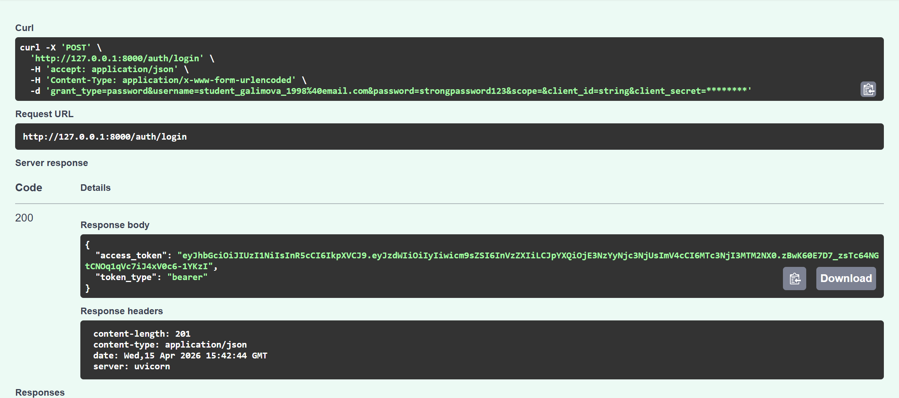
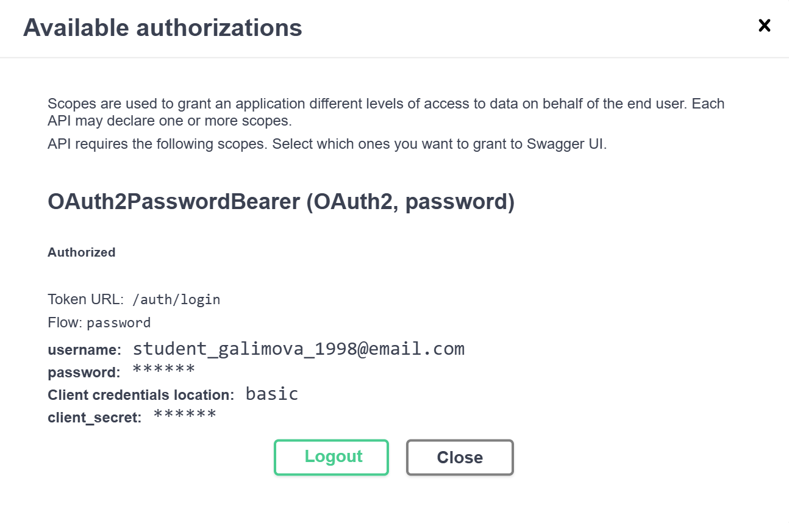
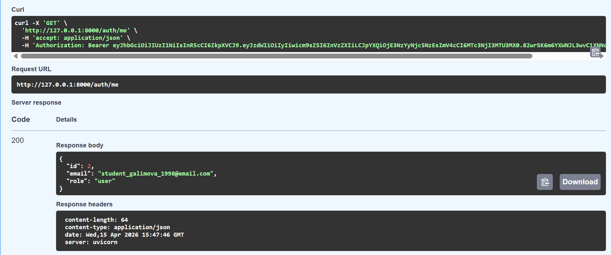
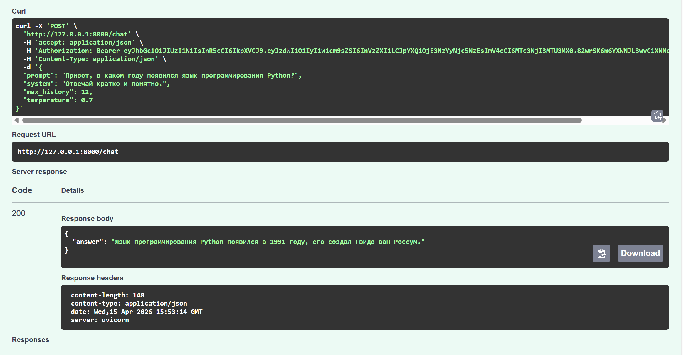
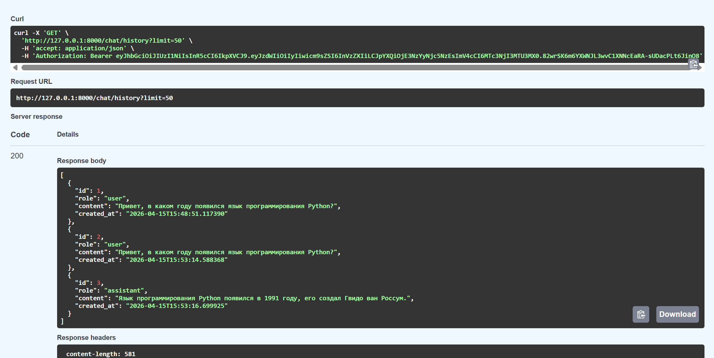
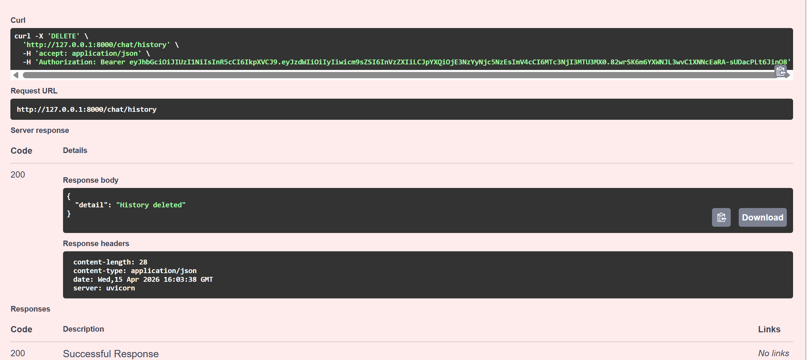
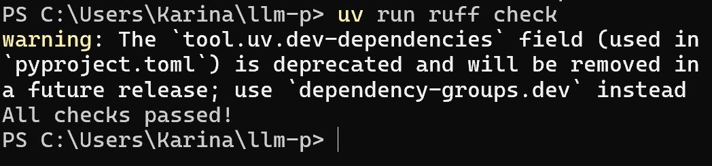

# LLM FastAPI Project


## Описание


Серверное приложение на FastAPI с JWT-аутентификацией, SQLite и интеграцией с OpenRouter.


---


## Установка


```bash

uv init

uv venv

.venv\\Scripts\\activate


uv pip install -r <(uv pip compile pyproject.toml)

```


---


## Запуск


```bash

uv run uvicorn app.main:app --reload --host 0.0.0.0 --port 8000

```


---


## Аутентификация


### Регистрация





### Логин





### Авторизация (Swagger)





### Получение профиля





---


## Работа с чатом


### Запрос к LLM





### История пользователя





### Очистка истории





---


## Проверка кода


```bash

uv run ruff check

```


Результат:




